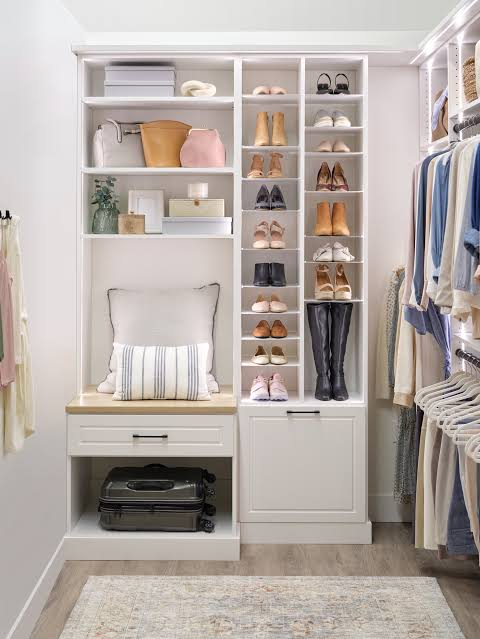

# Sprint 3 — Polish & Complete Flows
## "Make every tap feel intentional and every screen feel finished"

**File:** `2.html`
**Goal:** Build the remaining missing flows, fix image quality throughout, and wire up the planner tab into a proper hub. After Sprint 3 the prototype should be demo-ready end-to-end with no broken links, no placeholder screens, and no stock-photo mismatches.

---

## Fix 1 — Planner Tab Hub

**Problem:** The `planner` bottom-nav tab routes directly to Screen 47 (Outfit Calendar) with no way to access the Weekly Planner (Screen 49) or Packing Assistant (Screen 54). The brief describes the planner as containing three distinct tools.

**What to build — Screen 47 restructured as a Planner Hub:**

Change Screen 47's header section to include three mode tabs at the top:

```
[ Calendar ]  [ Weekly ]  [ Packing ]
```

- `Calendar` tab = current Screen 47 content (active by default)
- `Weekly` tab = link/navigate to Screen 49 (`data-target="screen-49"`)
- `Packing` tab = link/navigate to Screen 54 (`data-target="screen-54"`)

Use the `.chip` pattern for these tabs. The active tab uses `.chip.active`. The inactive tabs use `.chip` (no active class).

This avoids building a separate hub screen and re-uses existing screens as tab destinations, which is consistent with how the rest of the prototype is structured.

**Also wire:**
- Screen 49 back arrow → `data-target="screen-47"`
- Screen 54 back arrow → `data-target="screen-47"`
- Screen 55 back arrow → `data-target="screen-54"`

---

## Fix 2 — Screen 51 (Outfit Usage Analytics) — Rename and expand

**Problem:** Screen 51 is titled "Outfit Usage Analytics" but the brief calls this feature **"Sleeping Items"** — items unworn for 30+ days that get restyled and surfaced. The current screen handles this but is missing the restyling / action layer.

**What to add to Screen 51:**

1. **Section label:** Add a `Sleeping Items` section above the existing analytics content (or rename the screen header to match).

2. **Per-item action row:** Each sleeping item card should have two action chips:
   - `Style It` → `data-target="screen-31"` (see alternative looks using this item)
   - `Resell` → `data-target="screen-59"` (send to style budget / resale)

3. **Muse nudge card at top** (`.muse-card`):
   > *"14 items haven't been worn in 30+ days. Restyling them could save you from buying new."*
   With a gold accent border and the muse portrait.

4. **Bottom CTA:**
   - `View All Items` secondary-btn → `data-target="screen-42"`
   - `Open Style Budget` link → `data-target="screen-59"`

---

## Fix 3 — Screen 52 (Closet Gaps) — Add shopping link layer

**Problem:** Screen 52 identifies gaps but doesn't tell users what to do about them. The brief says gap analysis should route to smart shopping recommendations.

**What to add to Screen 52:**

Each gap card should have:
- A `Shop for this` chip → `data-target="screen-60"` (Wishlist — which shows gap items)
- A `Check Wishlist` chip → `data-target="screen-60"`

At the bottom of Screen 52 add:
- `.muse-card` nudge: *"Your Style Budget has £847 ready. Three of your gaps are under £100."*
- Primary CTA: `Shop Your Gaps` → `data-target="screen-60"`

---

## Fix 4 — Screen 53 (Duplicate Detection) — Add savings confirmation flow

**Problem:** Screen 53 shows duplicates but resolving them doesn't update the Savings Dashboard (Screen 58) or Style Budget (Screen 59). The flow feels incomplete — there's no reward for resolving.

**What to add to Screen 53:**

Each duplicate pair card should have a resolve row:
- `Keep Both` (chip, no action)
- `Resell One` chip → `data-target="screen-59"` (routes to style budget showing earned amount)
- `Donate` chip (no target, placeholder)

After the last duplicate card, add a `.card` savings summary:
- `Resolving these 3 duplicates adds £312 to your Style Budget`
- Primary btn: `Resolve All & Save £312` → `data-target="screen-59"`

---

## Fix 5 — Screen 29 (Home Dashboard) — Wire all missing entry points

The home dashboard is the most-visited screen but currently lacks links to the 3 new Sprint 2 screens.

**Add to Screen 29:**

1. **Style Score card tap** — The existing style score number/card must have `data-target="screen-57"`. Find the score element and wrap it or add the attribute to the parent card.

2. **Savings counter** — The home dashboard should show a savings figure. If one doesn't exist, add a small `.card` row below the morning card:
   - `£847 saved this year · View breakdown →` with `data-target="screen-58"`

3. **Muse insight card** — If a muse card exists on Screen 29, ensure its `View More` or detail link goes to `data-target="screen-38"`. The Muse tab in bottom nav should go to `data-target="screen-61"`.

4. **Bottom nav muse tab** — In the bottom nav on Screen 29 (and all screens), ensure the `data-nav="muse"` nav item has a click handler or `data-target="screen-61"`. Check the JS navigation handler — the nav items may need `data-target` attributes added if they don't already have them.

---

## Fix 6 — Photography Pass — Replace all outfit-context images in wardrobe screens

**Problem:** All wardrobe management screens (41–46, 51–53) use the same 6 editorial outfit images repeatedly. Item-level and wardrobe-management screens should use item-context photography, not outfit photography.

**Replacement strategy:**

The `/images/` folder has `closet.jpeg` and `closet.webp`. Use these with varied `object-position` values to simulate different item category feels.

For any carousel or grid showing individual items, use the following pattern for each item tile:
```html
<div class="relative overflow-hidden rounded-xl" style="height:80px;">
  
  <div class="absolute inset-0" 
       style="background:linear-gradient(to top,rgba(27,23,22,0.5) 0%,transparent 60%);"></div>
  <p class="absolute bottom-2 left-2 text-white text-xs font-medium">Item name</p>
</div>
```

**Object-position values to cycle through:** `center`, `top`, `bottom`, `left`, `right`, `20% 30%`, `80% 20%`

This creates the illusion of 7+ distinct item photos from 2 source images.

**Screens to update:**
- Screen 41: Recent Additions carousel (4 items) — each card
- Screen 42: Item grid within category — each item thumbnail
- Screen 43: Main item image (replace outfit photo with closet.jpeg, object-position: top)
- Screen 51: Sleeping items cards — item thumbnail
- Screen 53: Duplicate detection pair images — each item thumbnail

---

## Fix 7 — AI Sparkles / Loading states — Replace with brand-compliant spinner

**Problem:** DESIGN.md explicitly bans "AI sparkles as brand identity." If any processing screen (Screen 46 — Item Processing) uses a sparkles icon or pulsing sparkle animation as the main loading state, replace it.

**What to use instead (per DESIGN.md §DNA Loading Spinner):**
```html
<div class="relative w-16 h-16 mx-auto">
  <!-- Outer ring: 30% opacity -->
  <div class="absolute inset-0 rounded-full border-2 border-[#1B1716] opacity-30"></div>
  <!-- Inner spinning segment -->
  <div class="absolute inset-1 rounded-full border-2 border-transparent 
               border-t-[#1B1716] animate-spin"></div>
</div>
```

Replace any `data-lucide="sparkles"` used as a loading state with this spinner. Note: sparkles used as a static decoration (not animation, not loading indicator) are acceptable per DESIGN.md "Allowed: personalization cues."

---

## Fix 8 — Item Detail (Screen 43) — Add "Add to Outfit" and "Resell" deep links

**Problem:** Sprint 1 added a basic action row to Screen 43. Sprint 3 finalizes the item screen so every item has a complete lifecycle path.

**Complete action architecture for Screen 43:**

**Section 1 — Item Stats bar** (`.card grid grid-cols-3 divide-x`):
| Stat | Value |
|------|-------|
| Worn | 18× |
| Cost/Wear | £4.20 |
| Last Worn | 3 wks ago |

**Section 2 — Outfit suggestions** (`.section-label`: `Wear It With`):
- Horizontal scroll of 3 mini outfit cards (same `.image-card` pattern, height 100px)
- Each card: outfit image + `View Look →` → `data-target="screen-31"`

**Section 3 — Item Actions** (full-width, stacked):
- `Style This Item` primary-btn → `data-target="screen-31"`
- `Add to Weekly Plan` secondary-btn → `data-target="screen-49"`
- `Resell or Donate` secondary-btn → `data-target="screen-59"`

**Section 4 — Similar Items warning** (only show if applicable):
- `.card` with `alert-triangle` gold icon:
  > *"You own 2 similar navy blazers. Resolving saves £180."*
  - `View Duplicates` chip → `data-target="screen-53"`

---

## Fix 9 — Screen 56 (Closet Intelligence Summary) — Wire export and share

**Problem:** Screen 56 is the most "impressive" screen for a client demo but it's a dead end. Add forward paths that make the data actionable.

**Add to Screen 56:**

Bottom section after all analytics content:
- `.section-label`: `Take Action`
- 3 action rows (`.card` each, icon + label + chevron):
  1. `Resolve Duplicates · Save £312` → `data-target="screen-53"`
  2. `Wake Sleeping Items` → `data-target="screen-51"`
  3. `Fill Wardrobe Gaps` → `data-target="screen-52"`
- Separator
- `Share Your Style Report` secondary-btn (no action, placeholder — greyed out)
- `Back to Closet Hub` text link → `data-target="screen-41"`

---

## Acceptance Criteria for Sprint 3

- [ ] Bottom nav `planner` tab shows three mode chips: Calendar / Weekly / Packing
- [ ] Screen 49 (Weekly Planner) back arrow → Screen 47
- [ ] Screen 54 (Packing) back arrow → Screen 47
- [ ] Screen 51 has a Muse nudge card at top + resell/style chips on each sleeping item
- [ ] Screen 52 has a `Shop Your Gaps` CTA → Screen 60 (Wishlist)
- [ ] Screen 53 has a savings resolution CTA → Screen 59 (Style Budget)
- [ ] Screen 29 (Home) has a savings row linking to Screen 58
- [ ] Screen 29 Style Score card links to Screen 57
- [ ] Bottom nav `muse` tap navigates to Screen 61 on all screens
- [ ] All sparkle-as-loading-state instances replaced with dual-ring spinner
- [ ] Recent Additions carousel (Screen 41) and item thumbnails (Screen 42, 51, 53) use closet.jpeg / closet.webp with varied object-position, not outfit editorial photos
- [ ] Screen 43 shows a 3-stat bar, outfit suggestion carousel, and full action suite
- [ ] Screen 56 has a `Take Action` section with 3 links to resolution screens
- [ ] No screen has 0 outgoing navigation paths
